# 📚 LIBO: ROS2와 AI를 활용한 자율주행 서점 도우미 로봇

  <strong>서점 이용객에게는 편리함을, 직원에게는 효율성을 제공하는 똑똑한 자율주행 로봇 솔루션</strong>

<!-- 

  
  

 -->

---

# 📖 목차

- [1. 프로젝트 개요](#1-프로젝트-개요)
- [2. 주요 기능](#2-주요-기능)
- [3. 핵심 기술](#3-핵심-기술)
- [4. 기술적 문제 및 해결](#4-기술적-문제-및-해결)
- [5. 시스템 설계](#5-시스템-설계)
- [6. 프로젝트 구조](#6-프로젝트-구조)
- [7. 기술 스택](#7-기술-스택)
- [8. 프로젝트 관리](#8-프로젝트-관리)
- [9. 팀 구성](#9-팀-구성)

---

# 1. 프로젝트 개요

### 프로젝트 소개
'LIBO'는 스페인어로 책을 의미하는 ***Libro***와 ***Robot***의 합성어로, 서점에서 발생하는 반복적인 안내 및 운반 업무를 서포트하여 **고객 만족도**와 **운영 효율성**을 동시에 높이는 것이 목적인 서점 업무지원 자율주행 로봇 프로젝트 입니다.

- **고객:** 책의 위치를 쉽고 빠르게 찾아 드립니다.
- **직원:** 단순 반복 업무에서 벗어나 핵심 업무에 집중하도록 지원합니다.
- **서점:** 차별화된 고객 경험과 효율적인 매장 관리를 제공합니다.

### 프로젝트 기간
- 2025년 7월 14일 ~ 2025년 8월 13일
---

# 2. 주요 기능

## 🧭 Escort (고객 도서 위치 안내)

고객이 키오스크에서 찾고 싶은 책을 검색하면, LIBO가 해당 책이 있는 위치까지 안전하게 안내합니다.

<table>
  <tr>
    <th style="width:15%">주요 단계</th>
    <th style="width:50%">설명</th>
    <th style="width:35%">이미지/GIF</th>
  </tr>
  <tr>
    <td><b>1) 도서검색 및 에스코트 요청</b></td>
    <td>
      ▪ 키오스크에서 검색된 책의 위치 확인 후 에스코트 요청  
      ▪ 서점지도상의 서적코너 선택하여 에스코트 요청  
      ▪ 요청된 키오스크로 로봇이동
    </td>
    <td align="center">
      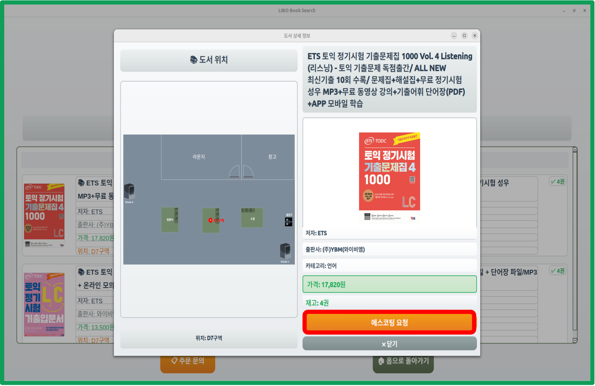
      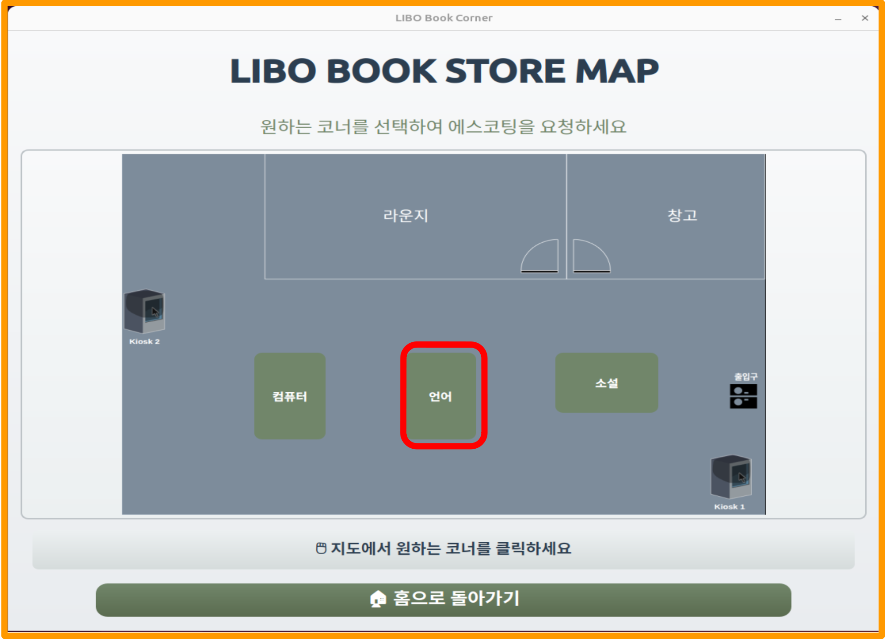 
      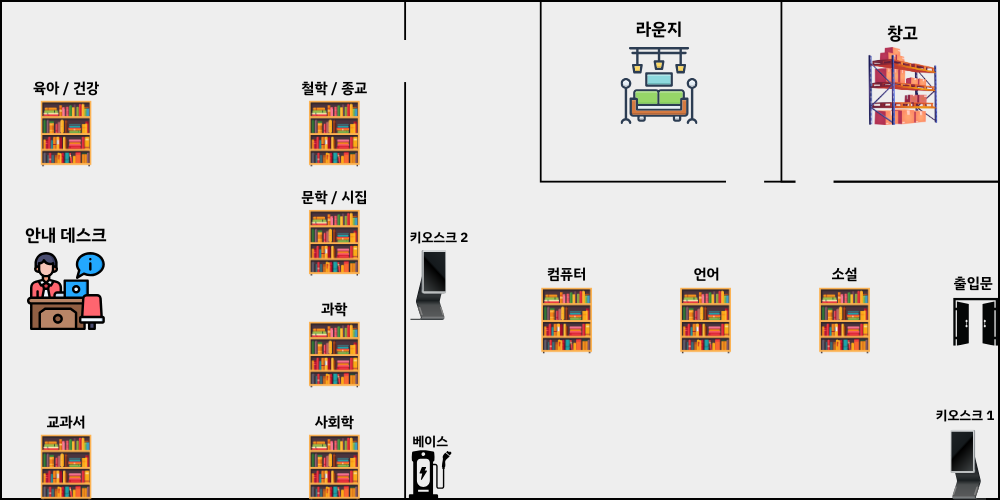
      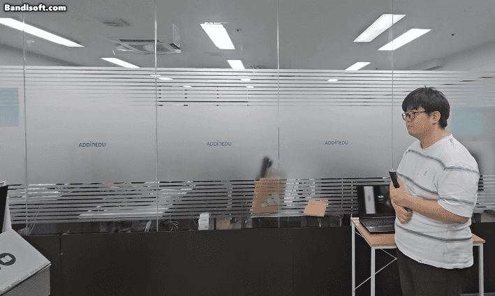
    </td>
  </tr>
  <tr>
    <td><b>2) 고객 안내 주행</b></td>
    <td>
      ▪ 키오스크에서 서적코너로 안내 시작 
      ▪ Nav2 기반 자율주행으로 목적지까지 이동
    </td>
    <td align="center">
      
      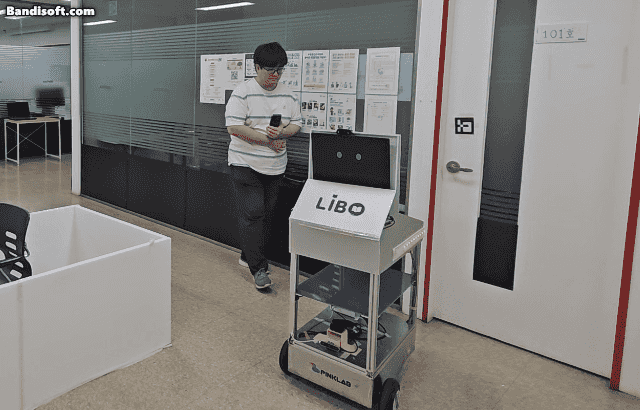
    </td>
  </tr>
  <tr>
    <td><b>3) 동행 확인</b></td>
    <td>
      ▪ 주행 중 후방 카메라로 고객이 잘 따라오는지 지속적으로 확인 
      ▪ 고객이 일정 시간 이상 보이지 않으면 안내음과 함께 잠시 대기 
      ▪ 고객의 장시간 이탈시 에스코트 자동종료
    </td>
    <td align="center">
      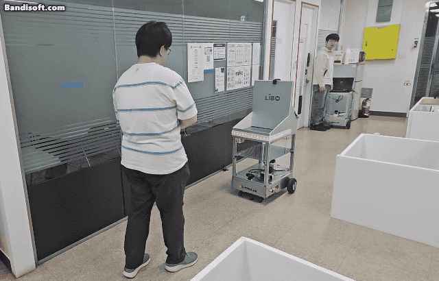
      
    </td>
  </tr>
  <tr>
    <td><b>4) 도착 및 복귀</b></td>
    <td>
      ▪ 목적지 도착 후 음성으로 안내 종료 알림 
      ▪ 초기 대기 장소로 복귀
    </td>
    <td align="center">*(이미지 삽입 위치)*</td>
  </tr>
</table>

## 🚚 Delivery (직원 도서 운반)

직원이 관리자용 GUI를 통해 새로 입고되거나 정리할 도서를 지정한 위치까지 운반시킵니다.

| 주요 단계 | 설명 | 이미지/GIF |
| :--- | :--- | :--- |
| **1) 원격 호출** | ▪ 직원데스크에서 로봇호출 |  
 
 |
| **2) 도서 적재 및 목적지 설정** | ▪ 도착한 로봇에 운반할 도서 적재 ▪ 로드셀 센서가 실시간으로 책 무게 측정하여 GUI에 표시 ▪ 직원 GUI에서 운반할 목적지 선택 후 출발 명령 | 
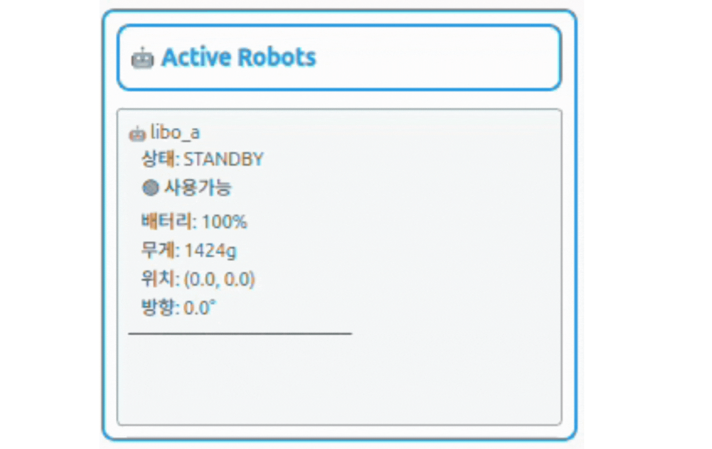 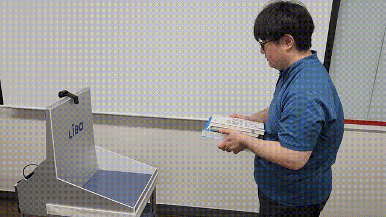
 |
| **3) 운반 주행** | ▪ 지정된 목적지까지 자율주행하여 이동 ▪ 직원 GUI에서 로봇의 현재 위치와 상태를 실시간 모니터링 |  
   
 |
| **4) 작업 완료 및 대기** | ▪ 목적지 도착 후 다음 명령을 대기하거나, 작업 종료 명령 시 대기 장소로 복귀 | *(이미지 삽입 위치)* |

## 🤝 Assist (직원 추종 및 보조)

직원이 서가 정리 등의 작업을 할 때, LIBO가 직원을 따라다니며 무거운 책을 대신 운반해주는 기능입니다.

| 주요 단계 | 설명 | 이미지/GIF |
| :--- | :--- | :--- |
| **1) 직원 인증 및 호출** | ▪ 키오스크에서 직원용 QR코드를 스캔하여 '직원용 호출' 기능 활성화 ▪ 로봇 호출 후, 도착한 로봇의 카메라에 QR코드를 2차인증 | 
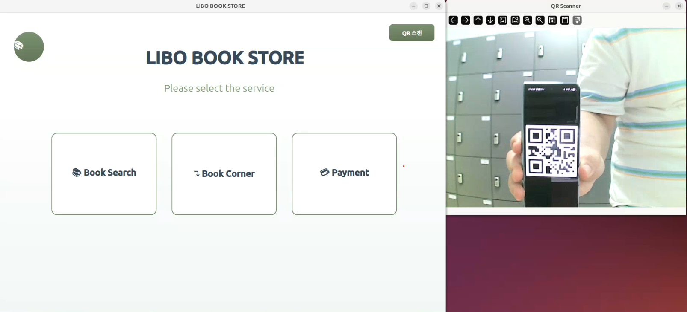 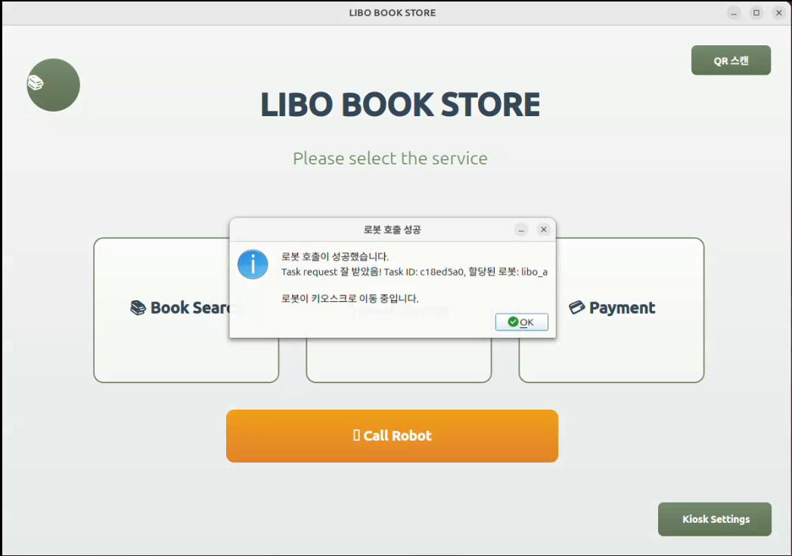
 |
| **2) 추종 모드 활성화** | ▪ 인증 완료 시 전방의 직원을 타겟으로 지정 ▪ 사람 추적(Person Tracking) 알고리즘을 통해 팔로우 모드 시작 | 
 
 |
| **3) 음성 및 제스처 제어** | ▪ "따라와", "잠깐만" 등 음성 명령으로 로봇 제어 ▪ 음성으로 '핸드 제스처 모드'로 전환 가능 ▪ MediaPipe 기반 손동작 인식(전진, 후진, 정지, 회전)으로 정밀 제어 | 
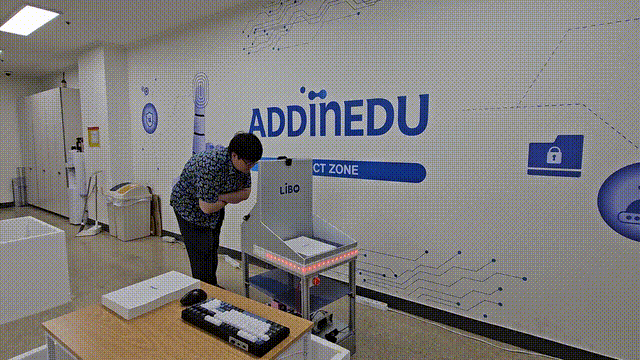   
 |
| **4) 작업 종료 및 복귀** | ▪ 직원이 음성으로 작업 종료를 명령하면 팔로우 모드를 해제 및 대기 장소로 복귀 | *(이미지 삽입 위치)* |

---

<!-- # 3. 핵심 기술

### 1) 경로 탐색 및 자율 주행
- **웨이포인트 기반 경로 계획**
  - Nav2의 기본 플래너가 장애물에 근접한 경로를 생성하는 문제를 해결하기 위해, 맵의 주요 지점을 웨이포인트로 지정하여 그래프를 구성했습니다.
  - **A\*** 알고리즘을 사용하여 출발지와 목적지 사이의 웨이포인트를 탐색, 가장 안정적이고 예측 가능한 경로를 생성하여 주행합니다.
- **장애물 회피 및 경로 재계획**
  - 주행 중 전방의 정적/동적 장애물을 인식하여 회피 기동을 수행합니다.
  - 만약 경로가 완전히 차단될 경우, 현재 위치를 기반으로 새로운 최적 경로를 재계산하여 주행을 재개합니다.

### 2) 사람 추적 및 Re-ID
- **YOLOv5 & StrongSORT 파이프라인**
  - YOLOv5를 통해 영상 내의 '사람'을 실시간으로 탐지합니다.
  - StrongSORT 알고리즘이 탐지된 각 사람에게 고유 ID를 부여하고, 외형적 특징(feature vector)을 비교하여 동일 인물을 지속적으로 추적합니다.
- **재식별(Re-Identification)**
  - 추적하던 대상이 잠시 가려지거나 프레임 밖으로 나갔다 다시 나타나도, 저장된 외형 특징과의 유사도 비교를 통해 동일 인물임을 재확인하고 추적을 유지합니다.

### 3) 음성인식 및 LLM 기반 상호작용
- **Wake Word → STT → LLM → TTS**
  - Porcupine 기반의 Wake Word("헤이 리보") 감지로 상호작용을 시작합니다.
  - Google STT API를 통해 사용자 음성을 텍스트로 변환합니다.
  - OpenAI의 LLM이 텍스트의 맥락과 의도를 분석하여 가장 적절한 답변을 생성합니다.
  - Google Cloud TTS API를 통해 생성된 텍스트 답변을 자연스러운 음성으로 출력합니다.

### 4) MediaPipe 기반 핸드 제스처 제어
- **손 랜드마크 인식**
  - MediaPipe 프레임워크를 활용하여 실시간으로 손의 21개 주요 랜드마크 좌표를 추출합니다.
- **제스처 분류**
  - 각 랜드마크의 상대적 위치, 손가락의 펴짐 여부, 손목의 방향 등을 계산하여 '전진(Go)', '후진(Back)', '정지(Stop)', '좌/우 회전' 등의 제스처로 분류하고, 이를 로봇 제어 명령으로 변환합니다. -->
  # 3. 핵심 기술  

## 🚗 경로 탐색 및 자율 주행  
| 주요 요소 | 설명 | 이미지/도식 |
| :--- | :--- | :--- |
| **웨이포인트 기반 경로 계획** | ▪ Nav2 기본 플래너를 활용하여 맵 주요 지점을 웨이포인트 그래프 구성 ▪ A* 알고리즘을 사용해 가장 안정적이고 예측 가능한 경로 생성 | 
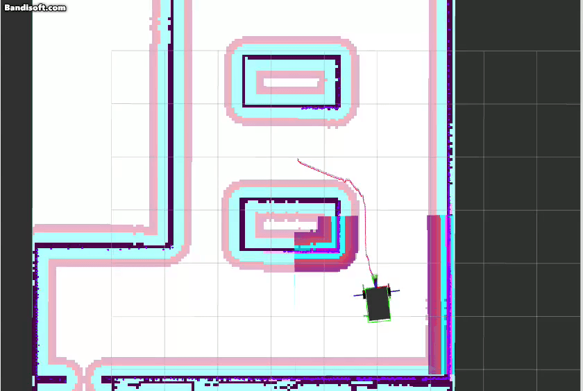  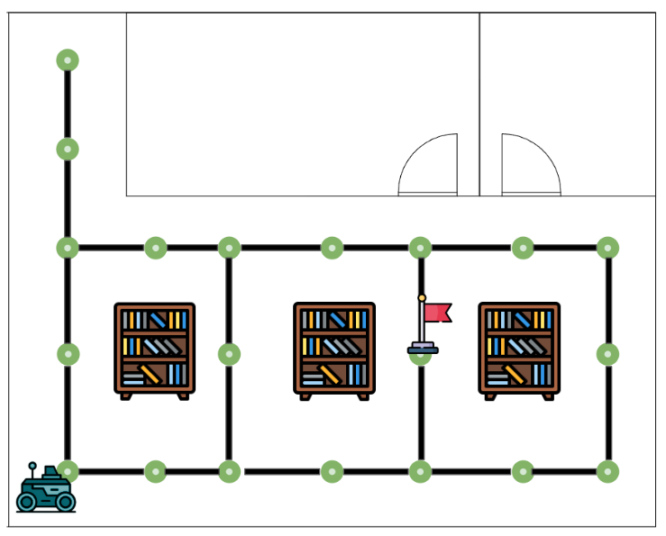 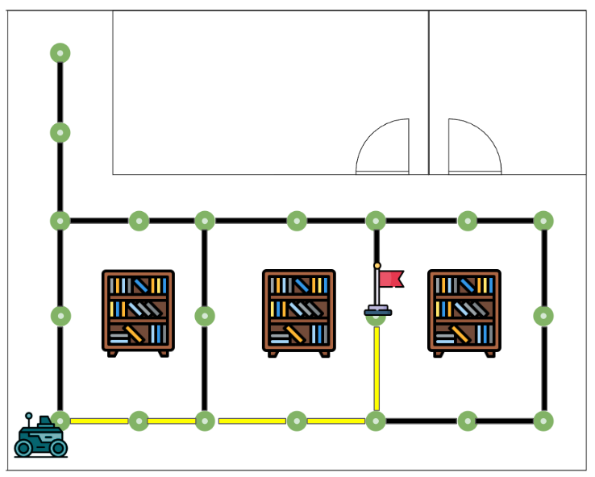
 |
| **장애물 회피 및 경로 재계획** | ▪ 주행 중 장애물 탐지 및 회피 ▪ 경로가 차단될 경우 현재 위치 기반으로 새로운 최적 경로를 재계산 및 주행 재개 | 
 
 |

---

## 👤 사람 추적 및 Re-ID  
| 주요 요소 | 설명 | 이미지/도식 |
| :--- | :--- | :--- |
| **YOLOv5 + StrongSORT** | ▪ YOLOv5로 영상 내 사람을 실시간 탐지 ▪ StrongSORT가 각 사람에 ID 부여 및 연속 추적 수행 | *(이미지 삽입 위치)* |
| **재식별(Re-ID)** | ▪ 대상이 잠시 가려져도 외형 특징 벡터 기반 유사도 비교 ▪ 동일 인물로 재식별하여 추적 안정성 확보 | *(이미지 삽입 위치)* |

---

## 🗣️ 음성인식 및 LLM 기반 상호작용  
| 주요 요소 | 설명 | 이미지/도식 |
| :--- | :--- | :--- |
| **Wake Word 감지** | ▪ Porcupine 기반 "헤이 리보" 호출어 인식 | *(이미지 삽입 위치)* |
| **STT → LLM → TTS 파이프라인** | ▪ Google STT: 음성 → 텍스트 변환 ▪ OpenAI LLM: 맥락 분석 및 답변 생성 ▪ Google TTS: 텍스트 → 음성 변환 | 
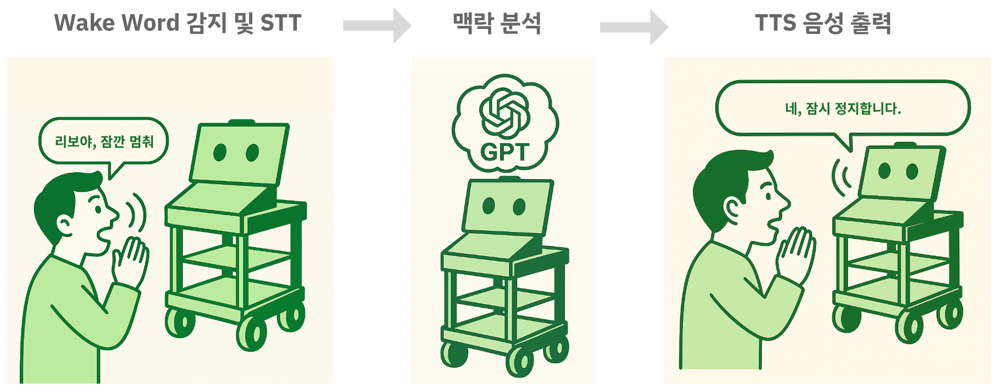 
 |

---

## ✋ MediaPipe 기반 핸드 제스처 제어  
| 주요 요소 | 설명 | 이미지/도식 |
| :--- | :--- | :--- |
| **손 랜드마크 인식** | ▪ MediaPipe로 손의 21개 주요 랜드마크 좌표 추출 | 
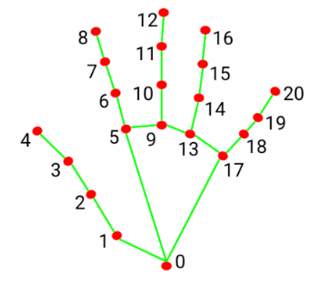
 |
| **제스처 분류 및 제어** | ▪ 손가락의 펴짐/굽힘, 방향 등을 분석 ▪ 전진, 후진, 정지, 회전 등 로봇 제어 명령으로 변환 | 

 |

---

# 4. 기술적 문제 및 해결

### 🤖 경로 계획의 안정성 문제
- **문제**: Nav2의 기본 경로 플래너 사용 시, 장애물이나 벽에 너무 가깝게 경로가 생성되어 주행 중 불안정성을 유발하고 충돌 위험이 있었습니다.
- **해결**: Nav2 파라미터들을 조율하고 주요 길목에 **웨이포인트를 설정**하고 이를 노드로 하는 그래프를 직접 구성했습니다. **A\* 알고리즘**으로 이 웨이포인트들을 경유하는 경로를 생성하도록 하여, 항상 안전하고 예측 가능한 중앙 경로로 주행하도록 개선했습니다.

### 👥 추종 대상 유실 문제
- **문제**: Assist 모드에서 직원이 다른 사람이나 서가에 의해 잠시 가려졌을 때, 추적 ID가 변경되거나 다른 사람을 타겟으로 오인하는 경우가 발생했습니다.
- **해결**: 단순 객체 추적을 넘어 **StrongSORT 알고리즘을 도입**했습니다. 이 알고리즘은 외형적 특징을 임베딩 벡터로 저장하여, 대상이 다시 나타났을 때 외형 유사도를 비교해 **재식별(Re-ID)**함으로써 추적의 연속성과 정확도를 크게 향상시켰습니다.

### ⚙️ 분산 시스템 간의 비동기 통신 문제
- **문제**: 로봇(ROS2), 중앙 서버, AI 서버, GUI 등 여러 컴포넌트가 독립적으로 동작하여 상태 동기화가 어렵고, 특정 기능 호출 시 응답 지연이 발생했습니다.
- **해결**: **중앙 서버(Libo Server)를 아키텍처의 중심으로** 설계하여 모든 작업 요청과 상태 관리를 총괄하도록 했습니다. ROS2 토픽은 로봇의 실시간 데이터(위치, 센서 값) 전송에, TCP 소켓 통신은 GUI와 서버 간의 작업 명령 및 상태 업데이트에 사용하는 등 프로토콜을 명확히 분리하여 안정적인 시스템 통합을 구현했습니다.

---

# 5. 시스템 설계

<b>시스템 아키텍처</b>

 
LIBO 시스템은 역할에 따라 명확하게 분리된 5개의 핵심 컴포넌트로 구성된 분산 아키텍처를 채택했습니다.

- **🤖 Libo Package:** 로봇의 구동과 하드웨어(카메라, 라이다, 마이크 등)를 직접 제어하는 ROS2 기반 온보드 소프트웨어입니다.
- **🧠 AI Server:** 음성 인식(STT), LLM 분석, 영상 분석(YOLO, MediaPipe) 등 높은 컴퓨팅 자원을 요구하는 AI 연산을 전담하는 서버입니다.
- **🖥️ Libo Server:** 모든 컴포넌트의 통신을 중재하고, 작업 할당 및 로봇 상태를 관리하는 중앙 제어 서버입니다.
- **👨‍💼 User Interfaces:** 고객이 사용하는 Kiosk GUI와 직원이 사용하는 Admin GUI로 구성된 사용자 인터페이스입니다.
- **☁️ Database (GCP):** 도서 정보, 로봇 상태 로그, 작업 이력 등 모든 영구 데이터를 저장하는 클라우드 기반 데이터베이스입니다.

*(아키텍처 다이어그램 이미지 삽입 위치)*

<b>상태 다이어그램 (State Diagram)</b>

 
로봇의 동작은 다음과 같은 상태 흐름을 따릅니다.

`초기화` → `충전` → `작업 대기` ↔ (`딜리버리` / `어시스트` / `에스코트` 수행) → `복귀` → `작업 대기`

- **초기화:** 시스템 부팅 및 모든 노드 활성화.
- **충전:** 작업 대기 전, 배터리 잔량이 충분하지 않을 경우 충전 상태로 전환.
- **작업 대기:** 충전 완료 후, Kiosk나 Admin GUI로부터의 명령을 대기.
- **임무 수행:** 할당된 작업(딜리버리, 어시스트, 에스코트)을 수행.
- **복귀:** 임무 완료 후 지정된 대기 장소로 이동.
- **종료:** 시스템 종료 명령 시 모든 노드를 안전하게 비활성화.

*(상태 다이어그램 이미지 삽입 위치)*

<b>ER 다이어그램 (Entity Relationship Diagram)</b>

 
데이터베이스는 도서, 위치, 로봇, 작업 등 주요 정보를 관리하기 위해 다음과 같은 테이블로 구성됩니다.

- **book:** 도서 정보 (제목, 저자, ISBN 등)
- **location:** 서가 위치 정보 (구역명, 좌표)
- **robot:** 로봇의 기본 정보 (모델명, 도입일)
- **admin:** 관리자 계정 정보
- **task_status_log:** 로봇이 수행한 작업의 로그 (작업 종류, 시작/종료 시간)
- **overall_status_log:** 로봇의 상태 변화 로그 (위치, 배터리, 무게)

*(ERD 이미지 삽입 위치)*

---

# 6. 프로젝트 구조

# 7. 기술 스택

| 분류 | 사용 기술 |
| :--- | :--- |
| **Robotics & Simulation** |   |
| **AI / Deep Learning** |     |
| **Development** |    |
| **GUI & Database** |    |
| **Collaboration** |     |

---

# 8. 프로젝트 관리

- **Jira:** 스프린트 기반의 애자일 방법론을 적용하여 태스크를 관리하고 진행 상황을 추적했습니다.
- **Confluence:** 요구사항 정의서, 설계 문서, 회의록 등 모든 산출물을 체계적으로 문서화하고 공유했습니다.
- **GitHub:** Git-flow 전략을 사용하여 소스 코드를 효율적으로 버전 관리하고 협업했습니다.

`[Jira/Confluence 스크린샷 이미지 삽입 위치]`

---

# 9. 팀 구성

| 이름 | 역할 | 담당 업무 |
| :--- | :--- | :--- |
| **이승훈** | 팀장 | 팀 총괄, KIOSK GUI 개발, 임베디드 설계, 시뮬레이션 환경 구축 |
| **김대인** | 팀원 | 시스템 메인 서버 설계 및 개발, ADMIN GUI 개발, 연동 테스트 기획/진행 |
| **박태환** | 팀원 | AI 비전 서버 시스템 개발, YOLO & StrongSort 모델 구현, 로봇 팔로잉 제어 개발 |
| **김민수** | 팀원 | LLM 음성인식 제어 설계, 핸드 제스처 로봇 제어 개발, DataBase 설계 및 구성 |
| **이건우** | 팀원 | 프로젝트 관리(Jira, Confluence), 시스템 시나리오 제작, SLAM & Navigation 알고리즘 |

